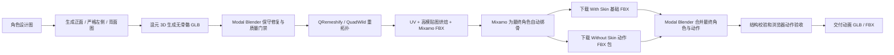

# 生图 + 混元 3D + Mixamo 角色生产工作流

本文档记录“角色设计图 -> 混元 3D 高模 -> Modal Blender/QRemeshify 网格规整 -> Mixamo 最终蒙皮与动作 -> 动画 GLB/FBX”的生产流程。目标交付不是结构上勉强有效的实验模型，而是经过网格门禁、蒙皮验证和动作视觉验收的游戏角色资产。

这是一条双足人形角色流程。四足、多足、蛇形和非标准骨架角色不能直接套用。

## 流程总览



旧的“UniRig 最终蒙皮 + Mixamo 动作重定向”仍保留用于已有角色回归，但不再是新角色的默认生产路径。新路径把清理后的最终角色直接上传 Mixamo，避免代理模型权重再次迁移到不同拓扑的穿衣模型。

## 输出约定

新角色统一使用一个小写连字符 slug，例如 `new-character`。建议采用以下路径：

| 阶段 | 路径 |
| --- | --- |
| 原始设计图 | `references/<slug>/concept.png` |
| 三视图 | `references/<slug>/front.png`、`left.png`、`back.png` |
| 混元原始网格 | `generated/<slug>-hunyuan-raw.glb` |
| 自动规整目录 | `generated/<slug>-animation-mesh/` |
| Mixamo 上传文件 | `generated/<slug>-animation-mesh/mixamo-upload.fbx` |
| 网格门禁报告 | `generated/<slug>-animation-mesh/mesh-report.json` |
| Mixamo 带蒙皮基础模型 | `generated/<slug>-mixamo-with-skin.fbx` |
| Mixamo 动作包 | `generated/<slug>-mixamo-actions.zip` |
| 最终动画 GLB | `generated/<slug>-animated.glb` |
| Unity/UE 动画 FBX | `generated/<slug>-animated.fbx` |

不要把 Hugging Face、Modal、Adobe 或腾讯账号令牌写入仓库。Modal 使用当前 CLI profile，网页阶段使用浏览器已有登录态。

## 1. 生成适合建模的三视图

### 输入要求

- 正面、严格左侧、背面三张图必须是同一角色、同一比例、同一地面线。
- 使用正交视图，避免透视、俯视、仰视和广角。
- 使用完整 T Pose；手臂水平展开，手和身体之间必须留有明显空隙。
- 去掉枪、弓、重武器、背包和其他手持道具。武器后续作为独立模型挂到手骨。
- 袖子、外套、裙摆、头发和身体之间要有清晰缝隙，不能跨接到躯干或另一条肢体。
- 双腿略微分开，膝盖和脚尖朝前；手指并拢或自然半握，避免完全张开的五指。
- 背景使用纯色或透明背景，不要文字、阴影、地台和装饰边框。

已验证的提示词结构：

```text
Create an orthographic character modeling turnaround with front, strict left-side,
and back views at identical scale. Full-body adult humanoid in a clean T-pose,
arms fully extended and separated from the torso, sleeves separated from the body,
legs separated, feet parallel and facing forward, hands relaxed with fingers together.
No weapon, no handheld prop, no perspective, no text, no shadow, plain background.
Preserve the same head-to-body ratio, shoulder width, arm length, leg length, clothing,
colors, face, hair and accessories in all three views.
```

当前使用 CPA/Sub2API 生图时，生成完成后通过 `sub2api-image-generator` 保存实际位图，再放入 `references/<slug>/`。同时在角色 manifest 中保留生成适配器、提示词和最终图片路径。

### 从组合图拆分

如果生成的是三视图组合图，必须使用实测裁框，不能默认等分：

```bash
python3 scripts/prepare_hunyuan_multiview.py \
  references/<slug>/turnaround.png \
  references/<slug> \
  --crop-spec '{"front":[0,0,700,941],"left":[700,0,986,941],"back":[986,0,1672,941]}' \
  --canvas-size 941
```

上面的裁框是 POPBOT 示例，新角色必须重新测量。裁图后检查头顶、手、鞋和手臂没有被截断，左侧图中的脸必须朝画面左侧。

## 2. 使用混元 3D 生成网格

### 方案 A：腾讯混元 3D 网页 V3.1（生产交付必选）

当前生产角色必须使用 [腾讯混元 3D](https://3d.hunyuan.tencent.com/) 网页版的多视图生成功能，并明确选择 `3D生成 - V3.1`。Modal/本地开源 Hunyuan3D-2 或 2mv 只能作为原型和故障回退，不能标记为 V3.1，也不能直接作为最终交付高模：

1. 将 `front.png`、`left.png`、`back.png` 放入对应视角，不要交换侧面和背面。
2. 选择人物建模或多视图模式，保持角色完整身体，不让平台自动裁掉手臂或鞋。
3. 生成后先在网页中旋转检查正面、背面、腋下、裆部、膝盖和袖口。
4. 质量优先角色选择网页允许的最高合理面数；生成完成后确认结果出现在账号的“资产”页面。
5. 下载 GLB，保存为 `generated/<slug>-hunyuan-web-v31-raw.glb`。
6. 在 manifest 或 provenance 中记录网页平台、`V3.1`、生成日期、网页显示面数/顶点数、输入图片和文件 SHA-256。

网页输出必须满足：

- 两条手臂、两条腿和躯干拓扑完整。
- 袖子没有粘到胸口，手臂下方没有跨接薄膜。
- 两腿之间有空隙，大腿内侧没有桥接或撕裂。
- 鞋是完整体，没有和地面或另一只鞋融合。
- 正面、脸和鞋尖方向一致。

几何已经融合时不要继续绑骨。UniRig、Mixamo 或权重修正不能可靠地把一块错误的连通网格重新变成分离袖子和躯干。

### 方案 B：Modal 上的 Hunyuan3D-2mv（原型/回退）

仅在用户明确接受开源回退、网页 V3.1 暂时不可用或进行非交付实验时，才使用当前 L4 基线：50 steps、380 octree resolution。该输出必须标记为 Hunyuan3D-2mv，不得称为网页 V3.1。

```bash
python3 -m modal run cloud/modal_hunyuan3d_mv.py \
  --front references/<slug>/front.png \
  --left references/<slug>/left.png \
  --back references/<slug>/back.png \
  --output generated/<slug>-hunyuan-raw.glb \
  --seed 12345 \
  --steps 50 \
  --octree-resolution 380 \
  --num-chunks 20000
```

Modal 会复用镜像和模型 Volume。缩容到零后下次只需要冷启动和模型加载，不需要重新安装整套环境；但不同 Modal 账号的镜像缓存、Volume、Secret 和免费额度彼此独立。

## 3. 自动化网格规整

### 身体可用但人脸身份漂移：生物头模替换

当混元全身模型的身体、服装、四肢和 T Pose 已通过，但脸型、五官或气质明显偏离参考图时，不必重新生成整个身体。可以单独生成一个无骨骼、带完整头颅和短颈的高质量头模，在 Mixamo 前替换身体的一体旧头：

生产头模必须使用 [腾讯混元 3D](https://3d.hunyuan.tencent.com/) 网页版 `3D生成 - V3.1`。使用正面和严格左侧人脸参考进入多视图图生 3D，选择最高实用面数，生成后在网页中旋转检查脸型、五官、耳朵、后脑、下颌、短颈和发型，再下载 GLB。保存为 `generated/<slug>-head-hunyuan-web-v31.glb`，并记录资产 ID、`HY3D-3.1`、日期、面数、顶点数、输入图和 SHA-256。

Modal/本地 Hunyuan3D-2、2mv 或其他开源重建只能作为头模实验候选，不能标记为 Web V3.1，也不能用于生产交付，除非用户明确接受回退方案。

```bash
python3 scripts/mixamo_character_pipeline.py replace-head \
  --body generated/<slug>-hunyuan-web-v31-raw.glb \
  --head generated/<slug>-head-hunyuan-web-v31.glb \
  --output-dir generated/<slug>-head-replacement \
  --body-cut-ratio 0.865 \
  --head-cut-ratio 0.12 \
  --neck-overlap 0.018 \
  --voxel-size 0.0045 \
  --texture-size 2048
```

输出：

- `head-replaced.glb`：无骨骼、头颈已融合的高模，作为后续 `prepare` 输入；
- `textures/base-color.png`、`normal.png`、`ao.png`：从身体和新头联合烘焙的外观；
- `head-replacement-report.json`：裁切、对齐、体素融合和拓扑报告。

独立头模要求：

- 使用正面和严格侧面参考生成，身份相似度优先于发丝细节；
- 包含完整后脑、下颌和一段短颈，不要只有面具或正面脸片；
- 中性表情、闭嘴或自然微张，避免夸张表情；
- 不含肩膀、胸口、首饰、背景壳体或手；
- 与身体使用相同的风格和肤色，头发不得与肩部融合。
- 网页资产必须确认出现在混元账号的“资产”页面并下载原始 GLB，不得从网页截图或预览缓存反推头模。

换头融合只能重建颈部附近的局部几何带。必须保留裁切线以下身体和服装的原始顶点、UV、材质与贴图；禁止把完整身体和头部连接后对整个人物执行 voxel remesh，也禁止为了颈缝重烘焙整套身体贴图。全身网格即使自动报告为 watertight，只要躯干、服装、手脚或材质表面出现体素化、黑斑或细节丢失，仍然直接判定 `blocked-head-replacement`。

参数含义：

- `body-cut-ratio`：从脚底到头顶的归一化旧头裁切高度；
- `head-cut-ratio`：从独立头模底部向上裁掉多余颈部的比例；
- `head-fit-height`：新头目标高度，0 表示按身体高度自动估算；
- `head-offset`、`head-rotation`：对齐微调，单位为米和 XYZ 角度；
- `neck-overlap`：新头向身体颈部压入的距离，确保体素融合有重叠；
- `voxel-size`：融合分辨率，越小越保留脸部细节，但耗时与面数更高。

必须先检查 `head-replaced.glb` 的正面、侧面和背面，确认身份、脸部比例、发型、颈缝和肩颈轮廓，再把它送入正常规整阶段：

```bash
python3 scripts/mixamo_character_pipeline.py prepare \
  --input generated/<slug>-head-replacement/head-replaced.glb \
  --output-dir generated/<slug>-animation-mesh \
  --target-faces 15000 \
  --target-height 1.9 \
  --texture-size 2048
```

换头后的整体网格必须再由 Mixamo 一次性绑骨。不要先绑身体再焊接裸脸；不要把新脸作为刚性子节点覆盖旧脸；不要从不同拓扑角色转移完整蒙皮权重。Mixamo 之后仅在动作验收发现颈部权重异常时，才对 Head/Neck 权重做局部修正。

直接拒绝：双层脸、旧头残留、颈部断缝、脸部体素化严重、头发与肩膀粘连、融合后非流形、头部比例与身体不协调，或新头身份仍明显不符。

不能把混元原始三角网格直接上传 Mixamo。新角色统一运行 Modal Blender/QRemeshify 阶段：

```bash
python3 scripts/mixamo_character_pipeline.py prepare \
  --input generated/<slug>-hunyuan-raw.glb \
  --output-dir generated/<slug>-animation-mesh \
  --target-faces 15000 \
  --target-height 1.9 \
  --texture-size 2048
```

`target-faces` 按最终三角面预算理解。普通角色可使用 15K 基线；厚重硬表面主角建议使用 40K~60K，并配合 4096 贴图。QRemeshify 的原始四边面输出可能明显低于目标，流水线会在不超过预算约 15% 的前提下执行简单细分，并把新增顶点回投到高模表面；必须以 `mesh-report.json` 的 `output.triangles` 和 `refinement` 为准，不能只相信命令行参数。

该阶段执行：

- 应用旋转和缩放，将模型统一到 1.9 米并把脚底放在原点。
- 合并极近重复点、删除游离顶点、清理退化几何并重算法线。
- 检查 T Pose 展臂比例，并在重拓扑后封闭边界环、清理多面共边、重算法线。
- Mixamo 上传模型必须满足 `boundaryEdges = 0`、`nonManifoldEdges = 0`。Mixamo 可能接受并显示带问题的 FBX，但自动绑骨后会无报错退回标记页，不能把这种状态误判为标记位置问题。
- 将高模保守预减面后交给 QRemeshify/QuadWild Bi-MDF 重拓扑。
- 当 QRemeshify 实际输出远低于目标预算时，自动细分并 Shrinkwrap 回投高模，恢复装甲轮廓密度。
- 为低模重新展开 UV，将高模 Base Color、Normal 和 AO 烘焙到低模。
- 输出可检查 GLB、Mixamo 上传 FBX、贴图和 JSON 报告。

这里的“通过”只表示输入可继续处理。袖子与胸口、手臂与脸或双腿已经大面积融合时，重拓扑无法恢复不存在的语义边界，必须回到三视图或混元阶段重新生成。

## 4. 准备 Mixamo 上传模型

上传 `generated/<slug>-animation-mesh/mixamo-upload.fbx`。这是最终低模角色，不是白模或代理模型；Mixamo 生成的 Skin 将直接用于最终交付。

上传前必须打开 `animation-ready.glb` 和 `mesh-report.json`，确认脸、胸口、鞋尖朝向一致，手臂与躯干之间存在真实空隙，报告中的 `passed` 为 `true`，并且 `output.boundaryEdges` 与 `output.nonManifoldEdges` 都为 `0`。

## 5. Mixamo 自动绑骨

上传 FBX 或 ZIP 后，先确认标记页显示角色正面：必须能看到脸、胸口和鞋尖。看到后脑、背部图案或脚跟时不要继续放置关节点。

标记位置：

- Chin：下巴中心，不要放在颈部。
- Wrists：手腕关节中心。
- Elbows：肘部弯曲中心。
- Knees：膝盖正面中心，左右高度一致。
- Groin：骨盆中心，不要过高到腹部。

上传前保持标准 T Pose。Mixamo 预览中若膝盖方向已经错误、手臂扭转或身体显示背面，应先修上传模型，不要靠后续左右骨名交换补偿。

## 6. 下载 Mixamo 动作

移动和跑动射击动作使用以下设置：

| 设置 | 值 |
| --- | --- |
| Format | `FBX Binary` |
| Skin | `Without Skin` |
| Frames per Second | `30` |
| Keyframe Reduction | `none` |
| In Place | 移动类动作开启 |

`In Place` 动作只提供步态，游戏控制器负责角色世界位移，更适合向前、向后和侧向移动。持枪跑动可直接使用 Mixamo 的 `Repeatedly Firing While Running With Rifle`。动作本身不包含枪模型，武器必须在运行时绑定到手骨或武器挂点。

单个动作命名示例：

```text
generated/<slug>-mixamo-run-forward-inplace.fbx
generated/<slug>-mixamo-rifle-run-fire-inplace.fbx
```

## 7. 合并 Mixamo 最终角色与动作

第一次下载角色时选择 `With Skin`，保存为 `generated/<slug>-mixamo-with-skin.fbx`。后续动作全部选择 `Without Skin` 并放入一个平铺 ZIP，文件名会转换为最终动画名。

```bash
python3 scripts/mixamo_character_pipeline.py finalize \
  --base-fbx generated/<slug>-mixamo-with-skin.fbx \
  --actions-zip generated/<slug>-mixamo-actions.zip \
  --output generated/<slug>-animated.glb \
  --output-fbx generated/<slug>-animated.fbx \
  --target-height 1.9
```

刚性头盔角色如果在 Mixamo 转头动作中出现下巴拉向胸口、头盔软化或胸椎权重污染，可在重新导出 GLB/FBX 时启用局部权重稳定：

```bash
python3 scripts/mixamo_character_pipeline.py finalize \
  --base-fbx generated/<slug>-mixamo-with-skin.fbx \
  --actions-zip generated/<slug>-mixamo-actions.zip \
  --output generated/<slug>-animated.glb \
  --output-fbx generated/<slug>-animated.fbx \
  --target-height 1.9 \
  --stabilize-helmet-weights
```

该选项把高 Head 权重区域刚性绑定到 Head，并把低比例过渡区域限制在 Head/Neck 骨链，阻止头盔被 Spine2 或肩部骨骼拉扯。它不是普通脸部、头发或软帽的默认选项；启用后仍必须检查左右转身、攻击和跳跃动作，确认胸甲与肩甲没有跟随头部旋转。

如果 Mixamo/FBX 往返后把整个人物材质写成 `BLEND`，出现背包、肩甲、胸口或腿部互相透视，应重新导出并强制角色材质不透明：

```bash
python3 scripts/mixamo_character_pipeline.py finalize \
  --base-fbx generated/<slug>-mixamo-with-skin.fbx \
  --actions-zip generated/<slug>-mixamo-actions.zip \
  --output generated/<slug>-animated.glb \
  --output-fbx generated/<slug>-animated.fbx \
  --target-height 1.9 \
  --force-opaque-materials
```

该选项会移除 Principled BSDF 的 Alpha 链接、将相关贴图 Alpha 归一为 1，并同时影响 GLB 和 FBX。角色确实包含透明玻璃、半透明披风或透明特效时不要启用，应把透明部分拆成独立材质并单独验收。

Modal Blender 会验证所有动作与基础模型使用同一套 Mixamo 骨架，将角色统一为 1.9 米并把脚底放到原点，再输出同时带最终网格、Skin 和全部动作的 GLB/FBX。导出后会重新导入 GLB，检查骨架、蒙皮网格、动作数量和实际高度；完成后 CLI 再运行 glTF 结构验证。

### 独立头盔、头部壳体、武器或背包装配

刚性配件应在 Mixamo 最终蒙皮和动作合并后装配，不要重新上传 Mixamo。独立 GLB 会在 Modal Blender 中对齐到指定骨骼，作为该骨骼的刚性子节点导出，并保留角色原有 Skin、骨架和全部动作：

```bash
python3 scripts/mixamo_character_pipeline.py attach \
  --character generated/<slug>-animated.glb \
  --part generated/<slug>-helmet.glb \
  --bone mixamorig:Head \
  --part-name Helmet \
  --part-anchor bottom \
  --bone-anchor head \
  --fit-height 0.36 \
  --offset 0,0,0 \
  --rotation 0,0,0 \
  --output generated/<slug>-helmet-equipped.glb \
  --force-opaque-materials
```

`--fit-height` 使用米作为目标配件高度，`--offset` 使用 Blender 世界米制坐标，`--rotation` 使用 XYZ 欧拉角度数。首次输出必须在 Bind Pose 和转头动作中校准位置，再把确认后的参数固定进 manifest。

常用骨骼：

| 配件 | 骨骼 | 推荐锚点 |
| --- | --- | --- |
| 封闭头盔、刚性头部壳体 | `mixamorig:Head` | `part-anchor=bottom`, `bone-anchor=head` |
| 单手武器 | `mixamorig:RightHand` 或 `mixamorig:LeftHand` | `part-anchor=origin`, `bone-anchor=head` |
| 背包 | `mixamorig:Spine2` | `part-anchor=center`, `bone-anchor=center` |

该命令不会切除身体一体网格里的原脸，也不会焊接颈部。裸脸换头必须改用第 3 节的 `replace-head`，并在换头、融合、UV/烘焙和规整完成后再上传 Mixamo。封闭头盔或带颈圈重叠的模块化头部才使用刚性装配。

## 8. 旧版动作重定向兼容路径

以下 UniRig/模板骨架重定向只用于已有 POPBOT 等历史资产。新角色走第 7 节的 Mixamo 最终蒙皮路径时不执行本节。

目标 GLB 必须已经包含最终角色网格、正确蒙皮和目标骨架。推荐先通过 `scripts/character_asset_pipeline.py` 或角色专用 rig 脚本生成 `<slug>-rigged-base.glb`，再追加 Mixamo 动作。

```bash
PYTHONPATH=scripts python3 scripts/retarget_mixamo_animation.py \
  generated/<slug>-rigged-base.glb \
  generated/<slug>-mixamo-candidate.glb \
  --source-yaw-degrees 0 \
  --animation Mixamo_RifleRunFire=generated/<slug>-mixamo-rifle-run-fire-inplace.glb
```

一次追加多个动作时重复 `--animation`：

```bash
PYTHONPATH=scripts python3 scripts/retarget_mixamo_animation.py \
  generated/<slug>-rigged-base.glb \
  generated/<slug>-mixamo-candidate.glb \
  --source-yaw-degrees 0 \
  --animation Mixamo_Idle=generated/<slug>-mixamo-idle.glb \
  --animation Mixamo_RunForward=generated/<slug>-mixamo-run-forward.glb \
  --animation Mixamo_RifleRunFire=generated/<slug>-mixamo-rifle-run-fire-inplace.glb
```

### 180 度朝向规则

- 新上传模型在 Mixamo 中显示正面时使用 `--source-yaw-degrees 0`。
- POPBOT 现有代理动作源与目标骨架相差 180 度，因此使用 `--source-yaw-degrees 180`。
- 朝向修正同时作用于世界旋转差和根位移。
- 左右始终按解剖学映射：Mixamo Left 对应目标 `.l`，Mixamo Right 对应目标 `.r`。
- 不允许通过交换左右骨骼修复朝向，否则会出现脸和腿方向相反、倒着跑或手脚交叉。

详细根因见 [mixamo-orientation-retarget-summary.md](mixamo-orientation-retarget-summary.md)。

## 9. 旧版只保留 Mixamo 动画

本节仅用于第 8 节的历史重定向模型。第 7 节生成的新角色已经只包含导入的 Mixamo 动作。

如果基础骨架带有 Commando 或 SpaceCommando 动画，全部 Mixamo 动作合并完成后执行：

```bash
PYTHONPATH=scripts python3 scripts/filter_glb_animations.py \
  generated/<slug>-mixamo-candidate.glb \
  generated/<slug>-mixamo-only-120k.glb \
  --keep-prefix Mixamo_
```

工具会真正从 glTF 动画目录中删除不匹配的动画，并同步更新 rig 动画数量；也支持输入和输出使用同一个文件进行原地替换。

## 10. 验证

### 结构验证

新 Mixamo 最终蒙皮路径：

```bash
python3 scripts/mixamo_character_pipeline.py validate \
  generated/<slug>-animated.glb
```

验证至少包括：标准 Mixamo 核心骨骼、可见蒙皮网格、有效关节索引、归一化权重、唯一动画名、有限关键帧，以及默认不存在 `BLEND`/`MASK` 角色材质。确实需要透明材质的特殊资产必须直接运行 `validate_mixamo_character.py --allow-transparent-materials` 并单独记录透明材质验收结果。

历史 UniRig/模板路径：

```bash
python3 scripts/validate_rigged_character.py \
  generated/<slug>-mixamo-only-120k.glb
```

至少确认：

- 存在一个可见蒙皮网格。
- 关节索引有效，权重和接近 1。
- Mixamo 动画名称和数量正确。
- 三角面、顶点数和模型高度没有异常变化。

运行全部回归测试：

```bash
PYTHONPATH=scripts python3 -m unittest discover -s tests -p 'test*.py'
```

### 浏览器验收

```bash
python3 -m http.server 8765 --bind 127.0.0.1
```

打开：

```text
http://127.0.0.1:8765/tools/unirig-preview.html?model=<slug>-animated.glb&clip=Mixamo_Running&time=0.375
```

每个动作至少检查正面和侧面的 `0.125`、`0.375`、`0.625`、`0.875` 四个归一化相位。

直接拒绝以下问题：

- 脸和跑动方向相反。
- 膝盖反折、腿直着跑、脚踝塌陷或脚尖外八。
- 大腿撕裂、鞋从中间弯折。
- 手指拉丝、手掌翻转或双手握持位置漂移。
- 袖子粘住胸口、外套跨接手臂或衣服出现长距离拉伸。
- 循环首尾明显跳变、头部或上身周期性抽动。

问题归因优先级：

| 现象 | 首先检查 |
| --- | --- |
| 袖子与身体一起拉伸 | 混元网格是否融合、袖子权重是否跨到躯干 |
| 脸与腿方向相反 | Mixamo 上传正面和 `source-yaw-degrees` |
| 手脚爆点 | 目标 skin 权重和 Bind Pose，不是动作分辨率 |
| 膝盖不弯或反折 | Mixamo 膝盖标记、目标骨轴和重定向相位 |
| 动作一顿一顿 | 关键帧插值、循环首尾和孤立旋转尖峰 |
| 持枪姿势正确但没有枪 | 正常现象，动作源不包含武器模型 |

## 11. 当前 POPBOT 回归样例

POPBOT 是旧版 UniRig/模板重定向路径的回归资产，用于确认历史模型不会因新管线而失效。新角色不再以该角色的 78 骨模板作为默认最终骨架。

当前可直接对照的输入和输出：

- 三视图：`references/popbot-hunyuan-tpose-v5/front.png`、`left.png`、`back.png`
- Mixamo 移动基础：`generated/popbot-hunyuan-v31-mixamo-locomotion-120k.glb`
- 跑动开火源 FBX：`generated/popbot-mixamo-rifle-run-fire-inplace.fbx`
- 跑动开火源 GLB：`generated/popbot-mixamo-rifle-run-fire-inplace.glb`
- 仅 Mixamo 最终候选：`generated/popbot-hunyuan-v31-mixamo-runfire-120k.glb`

最终候选当前保留 16 个动作：

```text
Mixamo_Idle
Mixamo_Jump
Mixamo_WalkForward
Mixamo_WalkBackward
Mixamo_WalkLeft
Mixamo_WalkRight
Mixamo_RunForward
Mixamo_RunBackward
Mixamo_RunLeft
Mixamo_RunRight
Mixamo_TurnLeft
Mixamo_TurnRight
Mixamo_TurnLeft90
Mixamo_TurnRight90
Mixamo_SprintForward
Mixamo_RifleRunFire
```

验证命令：

```bash
python3 scripts/validate_rigged_character.py \
  generated/popbot-hunyuan-v31-mixamo-runfire-120k.glb
```

预期结果为约 120k 三角面、78 关节、16 个动画和归一化蒙皮权重。

## 12. 发布与权利边界

通过结构和视觉验收后，再通过 `scripts/character_asset_pipeline.py` 或角色专用发布脚本登记 Wiki。发布前保留输入图、生成平台、模型版本、日期、脚本参数、SHA-256 和质量限制。

角色设计、混元生成模型、Mixamo 动作以及继承的游戏骨架可能分别受不同许可约束。默认仅用于本地研究、个人原型和技术验证；公开发布或商业使用前必须单独确认角色、模型和动作的分发权利。

## 复用检查表

- [ ] 三视图比例一致，严格正面/左侧/背面，无武器。
- [ ] 手臂、袖子、双腿和鞋之间完全分离。
- [ ] 混元 GLB 正面和鞋尖方向一致，没有融合薄膜。
- [ ] 自动规整目录包含 `animation-ready.glb`、`mixamo-upload.fbx`、贴图和通过的 `mesh-report.json`。
- [ ] QRemeshify 输出在肩、肘、髋和膝处没有塌陷或缺面。
- [ ] Mixamo 标记页显示角色正面，关节点落在真实关节中心。
- [ ] 第一次下载保存 `With Skin` 基础 FBX，动作下载使用 `Without Skin`。
- [ ] 移动类动作使用 `In Place`、`Without Skin`、30 FPS、无关键帧压缩。
- [ ] 最终 GLB 和 FBX 均包含最终角色网格、Mixamo Skin 与全部动作。
- [ ] 历史重定向资产才需要选择 0 或 180 度；新角色不得额外二次重定向。
- [ ] 正面和侧面检查四个相位，并播放完整循环。
- [ ] 结构校验和回归测试全部通过后才发布。
