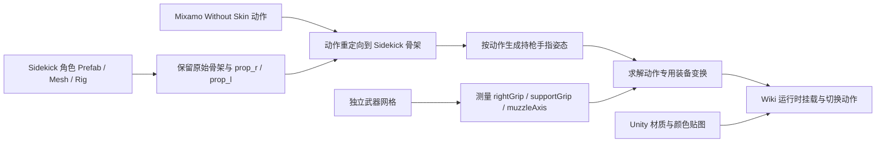

# Sidekick 角色持枪、动作与配色接入经验

本文记录 `Sci-Fi Civilians` 与 `Sci-Fi Battle Weapons` 接入 Game Model Wiki 时验证过的做法。目标不是让武器大致跟随右手，而是让枪托、握把、扳机、护木和枪口在持枪、站立射击、跑动射击中保持合理关系，同时恢复 Unity 资源包的原始配色。

这里的坐标和四元数是本批次 `ScifiRifle01_1` 的实测结果。流程可以复用，数值不能直接套给其他武器。

## 结论先行

- Sidekick Character Creator 负责组合角色部件、颜色和骨骼兼容性，不会自动解决任意外部武器的握把位置、枪口方向和射击动作。
- Mixamo 步枪动作不包含武器网格。角色完成绑骨和动作处理后，再把独立武器挂到角色骨架；不要带着刚性武器重新跑 Mixamo。
- Sidekick 角色优先使用专用武器挂点 `prop_r`，不要默认挂到 `hand_r`。双手武器还要用 `prop_l` 或左手目标校准护木位置。
- 先测量武器自身的握把、前手和枪口轴，再求角色挂点到武器锚点的刚性变换。只靠目测欧拉角很容易出现握把朝上、枪口朝后或枪身穿胸。
- 持枪待机、站立射击和跑动射击需要各自的装备变换。一个固定变换通常无法覆盖所有动作。
- 紫色、杂色或错误配色通常是贴图、UV 方向、色彩空间或 Unity 材质映射丢失，不是角色本身应有的颜色。

## 资产关系



## 1. 先识别正确挂点

本批次 Sidekick 骨架包含以下相关节点：

| 节点 | 用途 |
| --- | --- |
| `hand_r` | 右手骨骼，主要驱动手掌和手指 |
| `prop_r` | 右手道具挂点，位于掌心附近并带有道具预设朝向 |
| `prop_l` | 左手道具/辅助握持目标 |
| `ik_hand_gun` | 枪械 IK 目标或动画约束参考 |
| `ik_hand_r`、`ik_hand_l` | 左右手 IK 目标 |

`prop_r` 是 `hand_r` 的子节点。它已经把挂点放到掌心附近，因此本项目使用：

```json
{
  "equipmentBone": "prop_r"
}
```

初版直接挂到 `hand_r`，需要同时补偿手骨轴向、掌心偏移和武器自身轴向，导致枪支经常反拿。选择 `prop_r` 后，右手主握把成为稳定原点，剩余问题缩小为武器局部锚点和左手目标的对齐。

不能只凭骨骼名称判断。接入新的 Sidekick 包时，应读取实际 GLB/FBX 节点层级和 bind pose，确认挂点存在、父级正确且位于手掌附近。

## 2. 测量武器局部锚点

至少为双手枪械记录四个局部量：

```json
{
  "rightGrip": [0.0, -0.075, -0.085],
  "supportGrip": [0.0, -0.035, 0.255],
  "muzzleAxis": [0.0, 0.0, 1.0],
  "upAxis": [0.0, 1.0, 0.0]
}
```

- `rightGrip`：右手掌应该落到的手枪式握把位置。
- `supportGrip`：左手掌应该落到的护木或前握把位置。
- `muzzleAxis`：从枪托指向枪口的单位轴。本步枪是局部 `+Z`。
- `upAxis`：武器上方轴，用于约束滚转，保证握把朝下。

这一步应从真实网格的侧视图和包围盒测量，不要把模型原点当成握把。模型原点可能在几何中心、导出场景原点或任意 DCC 枢轴位置。

本次最关键的错误是把主握把和前握把在 Z 轴上的顺序写反。结果虽然能把两点“对齐”，但枪托与枪口方向翻转，枪身横穿躯干。必须满足：

```text
rightGrip.z < supportGrip.z
muzzleAxis 指向 rightGrip -> supportGrip 的大致方向
```

## 3. 用双手目标求刚性变换

对每个动作选定一个代表帧，读取：

- 右手目标 `R`：`prop_r` 的世界位置；
- 左手目标 `L`：`prop_l` 或经过验证的左手掌目标；
- 武器主握把 `gR`；
- 武器前握把 `gL`。

先用两点距离求统一缩放：

```text
s = |L - R| / |gL - gR|
```

再求旋转 `Q`，使武器局部向量 `gL - gR` 对齐到角色目标向量 `L - R`。两点只能确定朝向，不能唯一确定绕枪管轴的滚转，因此还要把武器 `upAxis` 投影到世界上方向对应的平面中，选择让握把朝下、枪身不翻转的滚转解。

最后求平移：

```text
T = R - Q * (s * gR)
```

运行时保存四元数 XYZW：

```json
{
  "position": [0.096768, 0.004881, -0.058001],
  "rotationQuaternion": [0.731112, -0.047561, 0.519142, -0.440119],
  "scale": [0.996182, 0.996182, 0.996182]
}
```

四元数比欧拉角更适合最终配置：它没有欧拉角顺序歧义，也不会在接近 90 度时产生明显跳变。兼容旧条目时可以保留 `rotationDeg` 回退，但新校准结果优先写 `rotationQuaternion`。

## 4. 按动作保存装备变换

本批次使用三个动作：

| 动作 | 用途 | 循环 |
| --- | --- | --- |
| `Mixamo_RifleReady` | 步枪持枪待机 | 是 |
| `Mixamo_RifleFireStanding` | 步枪站立射击 | 否 |
| `Mixamo_RifleRunFire` | 步枪跑动射击 | 是 |

最终实测配置：

```json
{
  "Mixamo_RifleReady": {
    "position": [0.096768, 0.004881, -0.058001],
    "rotationQuaternion": [0.731112, -0.047561, 0.519142, -0.440119],
    "scale": [0.996182, 0.996182, 0.996182]
  },
  "Mixamo_RifleFireStanding": {
    "position": [0.096525, 0.004488, -0.058229],
    "rotationQuaternion": [0.732707, -0.047608, 0.518573, -0.438127],
    "scale": [0.995232, 0.995232, 0.995232]
  },
  "Mixamo_RifleRunFire": {
    "position": [0.107935, 0.015305, -0.043925],
    "rotationQuaternion": [0.746999, 0.194202, 0.518711, -0.367719],
    "scale": [1.036815, 1.036815, 1.036815]
  }
}
```

跑动射击的上身扭转和双手间距与站立动作不同，因此旋转和缩放都有单独修正。切换动作时必须重新应用该动作的 `equipmentTransform`，不能只在初次加载武器时设置一次。

当前查看器行为：

1. 优先读取当前装备的 `option.actionTransforms[animation.clip]`；
2. 当前装备没有覆盖时，读取动作的 `animation.equipmentTransform`；
3. 两者都没有时，回退到装备选项默认变换；
4. 优先应用 `rotationQuaternion`；
5. 旧装备没有四元数时再读取 `rotationDeg`。

这一层装备覆盖对手枪尤其重要。步枪动作变换同时追踪左右手，不能直接覆盖到只需要锁定右手握把的手枪；否则即使手枪默认变换正确，播放步枪动作后仍会被重新移出掌心。

## 5. 手指姿态是最后一层修正

武器位置正确后再处理手指：

- 右手中指、无名指和小指包住主握把；
- 右手食指轻微弯曲，靠近扳机，不要和其他手指一样完全握紧；
- 左手食指、中指、无名指和小指包住护木；
- 拇指自然压住握把或护木侧面。

本批次为 30 根左右手指骨追加了持枪旋转通道。右手食指的弯曲角明显小于其他手指，避免穿过扳机护圈。

手指动画不能补偿错误的武器枢轴。如果掌心没有先落在握把上，继续卷手指只会让穿模更明显。

## 6. 配色恢复

### Sidekick 角色颜色图

角色使用资源包自带的 `T_<Character>ColorMap.png`。这类图是调色板/颜色查找式贴图，查看器应使用：

```text
colorSpace = sRGB
flipY = true
wrapS / wrapT = ClampToEdge
magFilter / minFilter = Nearest
generateMipmaps = false
```

原因：

- `flipY` 错误会让 UV 采样到调色板的另一行，颜色整体错位；
- 重复寻址会让边界采样串到调色板另一侧；
- 线性过滤和 mipmap 会混合相邻色块，产生资源包中不存在的杂色；
- Base Color 必须按 sRGB 解释，法线等数据贴图必须使用线性色彩空间。

看到整个人物变成紫色或品红色时，优先检查贴图是否成功加载、URL 是否正确、`flipY` 是否符合导出 UV，而不是先给材质乘一个补偿色。

### Unity 武器材质

武器 FBX 本身不一定携带完整 Unity 材质语义。恢复过程应读取：

1. Unity `.mat` 材质资源；
2. Prefab/Renderer 的材质槽分配；
3. Base Color、Emissive 和 Normal 贴图 GUID；
4. 实际使用这些贴图的材质名称。

然后把贴图复制到 Wiki，并只替换匹配的材质槽。不要把一张 Base Color 强行覆盖到所有子网格，否则发光件、玻璃、金属附件和未使用该贴图的材质都会错误着色。

法线贴图使用线性色彩空间；当前 Three.js 路径还需要翻转 normal Y 强度。发光贴图使用 sRGB，并保留独立的 `emissiveMap`。转换武器时同时移除 `UCX_`、`UBX_`、`USP_`、`UCP_` 碰撞节点，防止预览中出现额外实体。

## 7. 验收方法

不要用远距离全身截图批准持枪结果。至少检查近距离侧面和前侧 45 度视图，并确认：

- 枪托靠近肩窝，没有从肩膀外侧悬空；
- 枪口朝角色瞄准方向，不朝后或朝地面；
- 手枪式握把朝下；
- 右掌覆盖主握把，食指靠近扳机；
- 左掌覆盖护木或前握把；
- 枪身不穿胸口、前臂或脸；
- 动作播放时武器不脱手、不突然翻转。

每个动作检查归一化相位：

```text
0.125, 0.375, 0.625, 0.875
```

至少选择一个纤细角色和一个厚重角色回归。本批次使用 `ScifiCivilians_01` 与 `ScifiCivilians_06`，用于覆盖手臂长度、胸甲厚度和手套体积差异。

本批次校准后的左手支撑点偏差约为：

| 动作 | 最大偏差 |
| --- | ---: |
| 持枪待机 | `0.000001 m` |
| 站立射击 | `0.007146 m` |
| 跑动射击 | `0.031722 m` |

跑动动作误差更大，但仍处于手掌/手套能够覆盖的范围。数值通过不等于视觉通过，仍需检查枪托、枪口和穿模。

## 8. 自动化测试应验证几何语义

不要只锁定某组欧拉角或四元数常量。更可靠的测试应验证：

- `rightGrip` 变换后落在 `prop_r` 原点附近；
- `supportGrip` 变换后落在对应动作的左手目标附近；
- 变换后的 `muzzleAxis` 与主握把到前握把的方向点积足够大；
- 四元数全部有限且长度约为 1；
- 角色 GLB 确实包含 `prop_r` 和三项步枪动作；
- 持枪动作包含预期的手指动画通道；
- 手枪右食指指尖落在扳机护圈的局部空间范围内；
- 手枪三项动作在四个相位的 `prop_l`/`prop_r` 距离小于 5.5 厘米；
- 左手食指、中指、无名指和小指末端保持在主握把附近；
- 颜色贴图存在，调色板纹理标志和 `flipY` 配置正确；
- 武器 Base Color、Emissive、Normal 贴图存在，碰撞节点已移除。

这种测试允许后续重新校准姿势，同时持续阻止“枪口反向但常量恰好没变”一类回归。

## 9. 手枪必须使用独立动作族

仅把步枪换成手枪模型，即使 `rightGrip` 已经落到 `prop_r`，也不能得到正确的手枪姿势。步枪动作会继续把左手送到护木位置，因此表现为右手附近有枪、左手却悬在远处。这个问题不能通过继续微调武器平移或旋转解决。

当前项目把持枪动作分成两个动作族：

| 动作族 | 默认动作 | 射击动作 | 跑步动作 |
| --- | --- | --- | --- |
| `rifle` | `Mixamo_RifleReady` | `Mixamo_RifleFireStanding` | `Mixamo_RifleRunFire` |
| `pistol` | `Mixamo_PistolReady` | `Mixamo_PistolFireStanding` | `Mixamo_PistolRun` |

手枪动作来自 Mixamo 的双手手枪候选：

- `Idle With Aimed Pistol`，作为待机和射击的稳定双手基础姿态
- `Pistol Run - Running With Aimed Pistol`，下载时启用 `In Place`

下载设置统一为 `FBX Binary`、`Without Skin`、`30 FPS`、`Keyframe Reduction: none`。动作重定向到 Sidekick 骨架后，再追加手枪专用手指通道：右手中指、无名指和小指包住握把，左手四指从外侧支撑右手和握把。

不要假设所有手指都绕局部 `Z` 轴弯曲。Sidekick 右手食指沿默认掌面弯曲时，指尖会横向离开枪体约 6 厘米，即使侧面看起来已经弯曲，也没有进入扳机护圈。本项目把右手食指三节的弯曲轴绕指骨纵向旋转约 70 度，使最终指尖落到手枪局部坐标约 `[0.031, -0.016, 0.007]`，处于扳机护圈区域。

原先使用的 `Shooting - Firing A Gun` 是单手结构，`prop_l` 与 `prop_r` 在动作中相距约 9 至 10 厘米，无法通过卷曲手指修复。当前射击动作直接复用已验证的 `Idle With Aimed Pistol` 双手姿态，并给 `spine_01` 追加 5 帧、最大 4 厘米的短促后坐位移。这样既保持双手与枪口方向，又保留非循环射击反馈。

装备条目需要声明动作族和默认动作：

```json
{
  "family": "pistol",
  "actionFamily": "pistol",
  "defaultClip": "Mixamo_PistolReady"
}
```

动作条目同时声明 `weaponActionFamily`。查看器根据当前装备过滤不匹配的武器动作，并在切换装备后重新渲染动作列表、重新加载模型、播放该装备族的默认动作。不能只替换下拉框里的武器模型而继续播放原动作。

视觉验收必须覆盖细长和厚重两种体型。本次使用 `ScifiCivilians_01` 与 `ScifiCivilians_06` 检查持枪、射击和跑步，要求右掌覆盖握把、食指靠近扳机、左手贴住右手/握把、握把朝下、枪口朝前，并且动作循环中左手不漂离。

## 10. 常见失败与处理顺序

| 现象 | 首先检查 | 不应先做 |
| --- | --- | --- |
| 枪反着拿、握把朝上 | `muzzleAxis`、锚点前后顺序、滚转约束 | 随机追加 180 度欧拉角 |
| 右手没落在握把 | 是否挂到 `prop_r`、`rightGrip` 是否测自真实网格 | 继续卷曲手指 |
| 左手离开护木 | `supportGrip` 和动作专用左手目标 | 移动整个人物骨架 |
| 站立正确、跑动错误 | 跑动动作是否有独立变换 | 强行共用待机配置 |
| 手枪切换后又离开握把 | 当前装备是否有动作覆盖、步枪动作变换是否错误覆盖手枪 | 只修改初次加载位置 |
| 枪穿过胸口 | 枪托/枪口方向是否反转、动作帧是否选错 | 缩小角色或枪械掩盖问题 |
| 角色变成紫色/杂色 | 贴图路径、`flipY`、sRGB、Clamp、Nearest | 给材质乘补偿色 |
| 武器只有灰色或缺发光 | Unity 材质槽与贴图 GUID 是否恢复 | 只信 FBX 内嵌材质 |

## 对应实现

- `scripts/build_sci_fi_ultimate_packs.py`：Sidekick 骨架动作重定向、手指通道、武器锚点、动作专用变换、角色颜色图和 Unity 武器材质恢复。
- `index.html`：贴图采样配置、`rotationQuaternion`/`rotationDeg` 兼容和动作切换时重新应用装备变换。
- `tests/test_ultimate_pack_catalog.py`：挂点、动作、双手锚点、枪口方向、四元数、贴图和碰撞节点回归测试。
- `games/ultimate-pack/catalog.json`：Wiki 运行时使用的最终人物、动作与装备配置。

## 复用检查表

- [ ] 从角色文件确认 `prop_r`、`prop_l` 和 IK 节点的真实层级与位置。
- [ ] 从武器网格测量主握把、前握把、枪口轴和上方向轴。
- [ ] 确认锚点顺序与枪口方向一致。
- [ ] 使用双手目标求统一缩放、旋转和位移，并约束滚转。
- [ ] 使用 XYZW 四元数保存新配置。
- [ ] 为待机、站立射击和跑动射击分别校准装备变换。
- [ ] 武器变换正确后再追加手指弯曲。
- [ ] 角色调色板贴图使用 sRGB、`flipY`、Clamp、Nearest 且关闭 mipmap。
- [ ] 武器恢复 Base Color、Emissive、Normal 和材质槽映射。
- [ ] 检查四个动作相位、两个体型和近距离侧面/前侧视图。
- [ ] 自动化测试验证锚点、枪口方向、四元数和贴图语义。
- [ ] 完成装备装配后不再重新运行 Mixamo。
